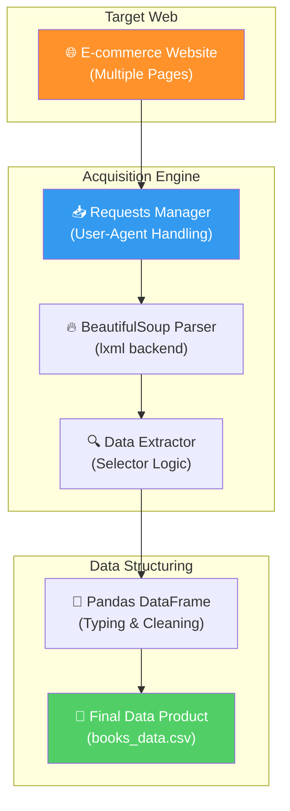
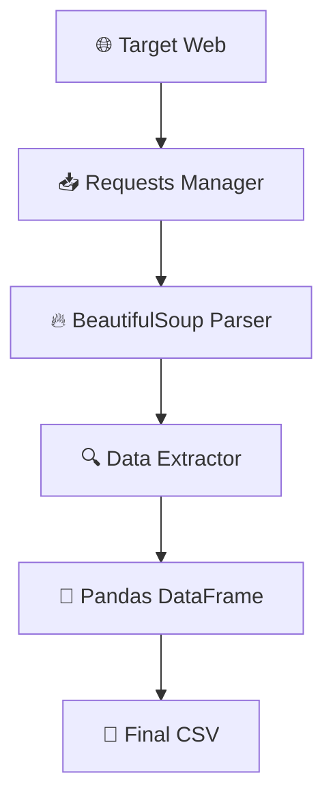

# 📚 BookHarvest: Enterprise Data Acquisition & Web Harvesting Engine

<p align="center">
  
  
  
  
  
</p>

**BookHarvest** è un motore di acquisizione dati (Web Scraper) progettato per la raccolta massiva e strutturata di informazioni da portali e-commerce. Il progetto implementa una pipeline di "harvesting" professionale che crawla cataloghi multi-pagina, estrae attributi di prodotto con alta precisione e produce Data Products (CSV/Parquet) pronti per l'analisi di Market Intelligence e Price Monitoring.

## 🏢 Valore Enterprise & Settori di Applicazione

| Settore / Ambito | Rilevanza & Benefici |
|-------------------|-----------|
| **Retail & E-commerce** | Competitive Price Monitoring: tracciamento automatico dei prezzi della concorrenza per dinamiche di repricing. |
| **Market Research** | Data Acquisition per l'analisi dei trend di mercato, disponibilità a stock e monitoraggio del sentiment (star ratings). |
| **Product Data Enrichment** | Arricchimento dei cataloghi aziendali tramite l'estrazione di metadati esterni da fonti web non dotate di API ufficiali. |
| **Lead Generation** | Raccolta automatizzata di contatti o informazioni aziendali da directory pubbliche per alimentare pipeline di vendita. |

---

## 🎯 Executive Summary & Valore di Business
BookHarvest risolve il problema dell'acquisizione dati da fonti web non strutturate, garantendo un flusso di informazioni pulito, tipizzato e automatizzabile.

### 🏛️ 1. Pipeline di Harvesting Modulare
* **Crawling Intelligente:** Rilevamento automatico della paginazione e gestione del loop di crawling per la scansione completa di cataloghi estesi (1.000+ record su 50+ pagine).
* **Single Responsibility Principle (SRP):** Codice strutturato in funzioni atomiche (`fetch`, `parse`, `extract`, `save`), facilitando la manutenzione e l'adattamento a nuove sorgenti web.

### ⚙️ 2. Resilienza e Performance
* **Gestione Errori & Retry:** Implementazione di logiche per la gestione dei timeout di rete e dei fallimenti di parsing, evitando il crash della pipeline durante sessioni di scraping prolungate.
* **Efficient Parsing (lxml):** Utilizzo del parser `lxml` sotto il cofano di BeautifulSoup per garantire velocità di esecuzione superiori rispetto al parser standard HTML di Python.

### 🛡️ 3. Data Quality & Logging
* **Structured Logging:** Sistema di log che traccia in tempo reale il progresso della raccolta, facilitando il monitoraggio e il debugging degli eventi critici.
* **Data Cleaning in-transit:** Trasformazione dei dati grezzi durante l'estrazione (es. conversione prezzi in float, normalizzazione rating in interi), garantendo un output immediatamente utilizzabile per analisi statistiche.

---

## 🏗️ Architettura del Motore



## 🛠️ Stack Tecnologico

| Layer | Tecnologia | Ruolo |
|:------|:-----------|:-----|
| 🐍 **Language** | Python 3.10+ | Core development |
| 🌐 **Networking** | Requests | HTTP Request Handling |
| 🔍 **Parsing** | BeautifulSoup4 / lxml | HTML Content Extraction |
| 🐼 **Structuring** | pandas | Data cleaning & CSV export |
| 📋 **Logging** | Python Logging | Process monitoring |

## 🚀 Setup

```bash
# Clone
git clone https://github.com/sylver86/05-book-scraper-python-beautifulsoup.git
cd 05-book-scraper-python-beautifulsoup

# Virtual Env & Install
python -m venv venv
source venv/bin/activate  # (venv\Scripts\activate su Windows)
pip install -r requirements.txt

# Run
python src/scraper.py
```

<br><br>

*Progettato e sviluppato da Eugenio Pasqua.*

---

# 🇬🇧 ENGLISH VERSION

# 📚 BookHarvest: Enterprise Data Acquisition & Web Harvesting Engine

<p align="center">
  
  
</p>

**BookHarvest** is a data acquisition engine (Web Scraper) designed for mass and structured information collection from e-commerce portals. The project implements a professional "harvesting" pipeline that crawls multi-page catalogs, extracts product attributes with high precision, and produces Data Products (CSV/Parquet) ready for Market Intelligence and Price Monitoring analysis.

## 🏢 Enterprise Value & Application Sectors

| Sector / Domain | Relevance & Benefits |
|-------------------|-----------|
| **Retail & E-commerce** | Competitive Price Monitoring: automatic tracking of competitor prices for dynamic repricing strategies. |
| **Market Research** | Data Acquisition for market trend analysis, stock availability, and sentiment monitoring. |
| **Product Data Enrichment** | Corporate catalog enrichment through external metadata extraction from web sources without official APIs. |

---

## 🏗️ Engine Architecture



## 🧰 Technology Stack

`Python 3.10+` · `requests` · `BeautifulSoup4` · `lxml` · `pandas`

<br><br>

*Designed and developed by Eugenio Pasqua.*
